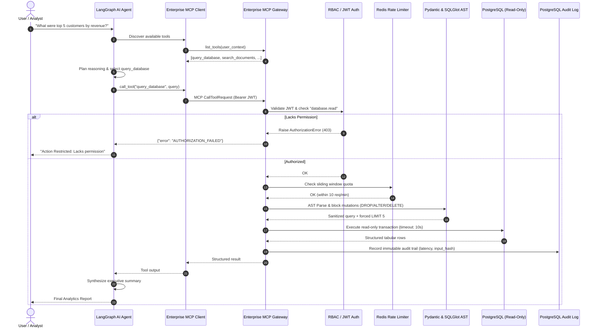

# MCP-Based Enterprise AI Tool Gateway

[](https://github.com/enterprise/mcp-enterprise-tool-gateway/actions)
[](https://www.python.org/downloads/)
[](https://modelcontextprotocol.io/)
[](https://fastapi.tiangolo.com)
[](https://langchain-ai.github.io/langgraph/)
[](https://www.sqlalchemy.org/)
[](https://www.postgresql.org/)
[](https://redis.io/)
[](https://github.com/astral-sh/ruff)
[](https://mypy-lang.org/)

A production-grade, security-hardened **Enterprise AI Tool Gateway** built on the **Model Context Protocol (MCP)** specification. This infrastructure component enables autonomous AI agents (powered by **LangGraph**) to dynamically discover, validate, and execute approved enterprise tools across relational databases, internal microservices, and knowledge repositories—without granting raw database credentials or unrestricted API access directly to the LLM.

---

## Table of Contents

1. [Problem Statement](#1-problem-statement)
2. [Why Model Context Protocol (MCP)?](#2-why-model-context-protocol-mcp)
3. [System Architecture](#3-system-architecture)
4. [Component Architecture](#4-component-architecture)
5. [Tool Execution Lifecycle](#5-tool-execution-lifecycle)
6. [Security & Zero-Trust Governance](#6-security--zero-trust-governance)
   - [JWT Authentication](#jwt-authentication)
   - [RBAC Tool Authorization](#rbac-tool-authorization)
   - [Multi-Tier SQL Safety Engine](#multi-tier-sql-safety-engine)
   - [Redis Sliding-Window Rate Limiting](#redis-sliding-window-rate-limiting)
   - [Hard Execution Timeouts](#hard-execution-timeouts)
7. [Immutable Audit Logging & Observability](#7-immutable-audit-logging--observability)
8. [LangGraph AI Agent Integration](#8-langgraph-ai-agent-integration)
9. [Enterprise Tool Catalog](#9-enterprise-tool-catalog)
10. [Database Schema & Migrations](#10-database-schema--migrations)
11. [API Reference & cURL Examples](#11-api-reference--curl-examples)
12. [Local Development Setup](#12-local-development-setup)
13. [Docker & Containerized Deployment](#13-docker--containerized-deployment)
14. [Testing & Quality Verification](#14-testing--quality-verification)
15. [Automated Interactive Demo](#15-automated-interactive-demo)
16. [Production Considerations & Trade-offs](#16-production-considerations--trade-offs)
17. [Senior Platform Engineer Resume Highlights](#17-senior-platform-engineer-resume-highlights)

---

## 1. Problem Statement

Enterprises looking to deploy LLM agents face severe architectural and security hurdles:

1. **Dangerous Direct Service Access**: Connecting LLMs directly to relational databases (`PostgreSQL`), CRM systems, or internal APIs creates catastrophic risks—prompt injection can trigger unauthorized schema drops (`DROP TABLE`), arbitrary mutations (`UPDATE/DELETE`), or cross-tenant data exfiltration.
2. **Fragile Point-to-Point Glue Code**: Every new AI tool requires ad-hoc LangChain wrappers, leading to fragmented authentication, brittle tool definition maintenance, and inconsistent error schemas across teams.
3. **Absence of Governance & Auditing**: LLM agents operating directly against production backends bypass enterprise SIEM and audit logging, leaving security teams blind to which user or agent triggered an operation.
4. **Denial-of-Service & Resource Exhaustion**: Unbounded queries generated by LLMs (`SELECT * FROM table` without limits) crash operational databases and starve memory pools.

---

## 2. Why Model Context Protocol (MCP)?

The **Model Context Protocol (MCP)**, open-sourced by Anthropic and standardized for the AI ecosystem, creates a clean separation of concerns:

- **Protocol Standardization**: AI clients (LangGraph agents, Claude Desktop, Cursor, IDEs) interface with tools via standardized JSON-RPC and Server-Sent Events (SSE).
- **Dynamic Tool Discovery**: Agents discover available tools, their input JSON schemas, output schemas, timeout limits, and required permissions at runtime.
- **Zero-Trust Tool Isolation**: The agent only knows *how to request a tool*. The gateway retains strict control over *whether to allow it*, validating identity, token permissions, query syntax, and rate quotas on the server before execution.

```
┌─────────────────────────────────┐
│  AI Agent / Client (LangGraph)  │
└────────────────┬────────────────┘
                 │
           MCP Protocol (SSE / JSON-RPC)
                 │
┌────────────────▼────────────────────────────────────────┐
│             Enterprise MCP Tool Gateway                 │
│ ┌──────────────────────┐      ┌───────────────────────┐ │
│ │ JWT / RBAC Engine    │      │ SQL AST Safety Guard  │ │
│ └──────────────────────┘      └───────────────────────┘ │
│ ┌──────────────────────┐      ┌───────────────────────┐ │
│ │ Rate Limiter (Redis) │      │ Audit Logger (PG SQL) │ │
│ └──────────────────────┘      └───────────────────────┘ │
└────────────────┬────────────────────────────────────────┘
                 │ Internal Service Abstractions
    ┌────────────┼─────────────┬─────────────┐
    ▼            ▼             ▼             ▼
PostgreSQL   Documents     Internal APIs    Redis
Database      Search      (Customer/Order)   Cache
```

---

## 3. System Architecture



---

## 4. Component Architecture

```
mcp-based-enterprise-ai-tool-gateway/
├── app/
│   ├── main.py                     # FastAPI application factory, MCP SSE mount, middleware
│   ├── api/                        # REST management endpoints
│   │   ├── auth.py                 # POST /auth/login, GET /auth/me
│   │   ├── health.py               # GET /health, GET /ready (deep probes)
│   │   ├── tools.py                # GET /tools, GET /tools/{name}, POST /tools/{name}/execute
│   │   ├── audit.py                # GET /audit/logs (paginated compliance queries)
│   │   └── copilot.py              # POST /agent/chat (Analytics Copilot endpoint)
│   ├── core/                       # Foundational infrastructure
│   │   ├── config.py               # Pydantic v2 Settings (12-factor env configuration)
│   │   ├── errors.py               # Standardized error codes & exception hierarchy
│   │   ├── logging.py              # Structured JSON logging with contextvars tracing
│   │   └── security.py             # Bcrypt hashing & PyJWT token encode/decode
│   ├── mcp/                        # Model Context Protocol layer
│   │   ├── server.py               # MCPServer with dynamic Pydantic signature reflection
│   │   ├── client.py               # EnterpriseMCPClient (in-process + SSE transport)
│   │   └── registry.py             # Central ToolRegistry with RBAC, validation & audit
│   ├── tools/                      # Modular Enterprise Tools
│   │   ├── base.py                 # BaseEnterpriseTool abstract class & schema reflection
│   │   ├── database.py             # query_database (read-only PostgreSQL execution)
│   │   ├── sql_validator.py        # SQLGlot AST parser blocking mutations and enforcing limits
│   │   ├── documents.py            # search_documents (keyword + vector abstraction)
│   │   ├── customer.py             # get_customer (CRM lookup)
│   │   ├── invoice.py              # get_invoice (billing intelligence)
│   │   ├── order.py                # get_order (fulfillment status)
│   │   ├── system.py               # get_system_status (telemetry & latency)
│   │   └── kpi.py                  # calculate_kpi (executive metric calculations)
│   ├── agent/                      # LangGraph AI Agent
│   │   ├── graph.py                # StateGraph workflow (discovery -> plan -> execute -> synthesize)
│   │   ├── state.py                # AgentState TypedDict schema
│   │   └── llm.py                  # Modular LLM factory (OpenAI live + EnterpriseMockLLM)
│   ├── auth/                       # Access control domain
│   │   ├── permissions.py          # Permissions enum and default role-permission matrix
│   │   ├── models.py               # UserContext, TokenResponse, LoginRequest models
│   │   └── jwt.py                  # FastAPI dependency injection & bearer extraction
│   ├── database/                   # Data access layer
│   │   ├── base.py                 # DeclarativeBase and TimestampMixin
│   │   ├── models.py               # SQLAlchemy 2.0 async mapped entities
│   │   ├── session.py              # Async connection pool & read-only session maker
│   │   └── repositories.py         # Repository pattern for entities & audit logs
│   ├── services/                   # Business logic abstractions
│   │   ├── audit.py                # Immutable audit persistence & SHA-256 parameter hashing
│   │   ├── rate_limit.py           # Redis sliding-window algorithm with memory fallback
│   │   ├── customer_service.py     # Customer domain service
│   │   ├── invoice_service.py      # Invoice domain service
│   │   ├── order_service.py        # Order fulfillment domain service
│   │   ├── document_service.py     # Document search & vector provider hook
│   │   └── system_service.py       # Diagnostic & dependency health checks
│   └── schemas/                    # Pydantic v2 validation contracts
│       ├── common.py               # ToolMetadata, APIResponse, HealthResponse
│       └── tools.py                # Strict input/output schemas with extra="forbid"
├── alembic/                        # Database migration scripts
│   ├── env.py
│   └── versions/                   # Versioned DDL migrations
├── tests/                          # 77 Comprehensive Automated Tests
│   ├── conftest.py                 # In-memory async SQLite engine & seed fixtures
│   ├── unit/                       # Unit tests (auth, RBAC, AST, rate limit, timeout)
│   ├── integration/                # Integration tests (tools, MCP server, MCP client, agent)
│   └── security/                   # Security tests (privilege escalation, SQLi, DDL attacks)
├── scripts/
│   ├── seed_data.py                # Production seed script for PostgreSQL
│   ├── run_demo.py                 # Interactive demonstration script
│   └── entrypoint.sh               # Docker container startup orchestrator
├── Dockerfile                      # Production multi-stage Docker build
├── docker-compose.yml              # Multi-container stack (api, postgres, redis)
├── pyproject.toml                  # Modern Python packaging & tool configurations
└── .github/workflows/ci.yml        # Multi-stage CI pipeline (lint, type-check, test, build)
```

---

## 5. Tool Execution Lifecycle

Every tool call processed by the Gateway passes through eight sequential enforcement stages:

1. **Protocol Ingestion**: The MCP Server accepts a request via SSE or direct bridge.
2. **Context & Identity Extraction**: JWT bearer token is extracted and validated, resolving active roles and permissions.
3. **RBAC Policy Enforcement**: Backend checks whether `required_permission in user.permissions`. Rejects unauthorized attempts with `AUTHORIZATION_FAILED`.
4. **Sliding-Window Rate Quota**: Redis evaluates invocation counts in the configured window (e.g., 10 req/min). Rejects bursts with `TOOL_RATE_LIMITED` (HTTP 429).
5. **Schema Contract Validation**: Strongly typed Pydantic v2 model validates input data types, constraints, and rejects unexpected properties (`extra="forbid"`).
6. **Domain Safety Guard**: For SQL queries, SQLGlot traverses the Abstract Syntax Tree (AST) to ensure the query is strictly a `SELECT`, prohibits multi-statement attacks, blocks catalog tables, and bounds `LIMIT <= 1000`.
7. **Timeout-Guarded Async Execution**: Execution runs inside `asyncio.wait_for(...)`. If execution exceeds the per-tool timeout (e.g. 10s), execution is aborted and raises `TOOL_TIMEOUT`.
8. **Immutable Audit Persistence**: Regardless of success or failure, an audit record containing `request_id`, `user_id`, `tool_name`, `input_hash` (SHA-256 of sanitized input with secrets redacted), `latency_ms`, and `execution_status` is committed to PostgreSQL.

---

## 6. Security & Zero-Trust Governance

### JWT Authentication
Access tokens are signed using HMAC-SHA256 (`HS256`) with a cryptographically strong secret. Claims include:
- `sub`: User ID
- `username`: Username
- `roles`: Assigned roles (`admin`, `analyst`, `viewer`, `agent`)
- `permissions`: Expanded permissions list
- `exp`: Expiration timestamp (default: 60 minutes)

### RBAC Tool Authorization
Authorization is strictly evaluated in Python backend code—never delegated to the LLM.

| Role | Permissions | Available Tools |
| :--- | :--- | :--- |
| **Admin** | All permissions + `audit.read` | All tools + Audit inspection |
| **Analyst** | `database.read`, `documents.search`, `customer.read`, `invoice.read`, `order.read`, `kpi.calculate` | `query_database`, `search_documents`, `get_customer`, `get_invoice`, `get_order`, `calculate_kpi` |
| **Agent** | Operational tool permissions | `query_database`, `search_documents`, `get_customer`, `get_invoice`, `get_order`, `get_system_status`, `calculate_kpi` |
| **Viewer** | `documents.search`, `system.status` | `search_documents`, `get_system_status` (All database queries blocked) |

### Multi-Tier SQL Safety Engine
The `query_database` tool provides defense-in-depth:
1. **Keyword Screening**: Quick regex screen blocking destructive operations (`DROP`, `ALTER`, `TRUNCATE`, `INSERT`, `UPDATE`, `DELETE`, `GRANT`, `VACUUM`, `EXEC`).
2. **AST Parsing (`SQLGlot`)**: Parses the query into a syntactic tree:
   - Root expression must be `exp.Select` or `exp.Union`.
   - Rejects queries containing multiple statements (preventing `; DROP TABLE ...`).
   - Traverses tree to ensure no nested mutation sub-expressions exist.
   - Prohibits system catalog tables (`pg_shadow`, `pg_authid`, `pg_user`).
   - Automatically clamps or injects safe `LIMIT <= 1000`.
3. **Transaction Read-Only Mode**: Sets `SET TRANSACTION READ ONLY` on PostgreSQL connections.
4. **Dedicated Read-Only Connection Pool**: Configurable secondary database URL for read-replica routing.

### Redis Sliding-Window Rate Limiting
Uses Redis sorted sets (`ZREMRANGEBYSCORE`, `ZCARD`, `ZADD`, `EXPIRE`) to track timestamps within a sliding window. Provides seamless in-memory fallback if Redis is temporarily unreachable.

### Hard Execution Timeouts
Prevents long-running queries or hung external services from exhausting workers. If a tool exceeds its configured threshold (`timeout_seconds`), it is cancelled via `asyncio.wait_for` and returns `TOOL_TIMEOUT`.

---

## 7. Immutable Audit Logging & Observability

### Audit Records in PostgreSQL
Every tool invocation attempt generates an audit row in the `audit_logs` table:

```sql
SELECT request_id, tool_name, user_id, execution_status, latency_ms, timestamp
FROM audit_logs ORDER BY timestamp DESC LIMIT 5;
```

```text
request_id                           | tool_name        | user_id         | execution_status | latency_ms
-------------------------------------+------------------+-----------------+------------------+------------
7eabbd2e-ae44-4f4e-a90e-6d5c168b1f18 | query_database   | user-analyst-bob| SUCCESS          | 99.21
0fb695ad-0190-47de-b98b-c2c257beba41 | search_documents | user-analyst-bob| SUCCESS          | 18.73
99808821-7b00-412c-8cff-7640013ab409 | query_database   | user-analyst-bob| FAILED           | 3.05
8425e2ef-4ea3-4234-a727-76450d3abb4d | query_database   | user-viewer-002 | DENIED           | 0.04
```

### Sensitive Data Redaction
Parameters containing `password`, `token`, `secret`, `api_key`, or `authorization` are masked with `[REDACTED]` before computing a deterministic SHA-256 input hash:

$$\text{Input Hash} = \text{SHA256}(\text{JSON}(\text{SanitizedParams}))$$

### Structured Contextual Logging
Logs are formatted in structured JSON using Python `contextvars` to propagate `request_id`, `trace_id`, `user_id`, and `tool_name` throughout the call stack without passing explicit logging arguments.

---

## 8. LangGraph AI Agent Integration

The Analytics Copilot is built using **LangGraph** (`StateGraph`):

```text
User Question 
     │
     ▼
[discover_tools]  ─── Discovers tools from MCP Gateway based on user JWT
     │
     ▼
[plan_and_select] ─── Analyzes intent and generates tool call JSON
     │
     ├─ Has Tools? ──► [execute_mcp_tools] ─── Invokes Gateway via MCP Client
     │                                                │
     ▼                                                ▼
[synthesize_answer] ◄─────────────────────────────────┘
     │
     ▼
Executive Report
```

### Modular LLM Provider
- **OpenAI Live**: When `OPENAI_API_KEY` is supplied, uses `langchain_openai.ChatOpenAI`.
- **EnterpriseMockLLM**: Deterministic, offline-capable fallback LLM enabling 100% automated tests, CI builds, and zero-cost local demonstrations without third-party API dependencies.

---

## 9. Enterprise Tool Catalog

| Tool Name | Risk Level | Timeout | Required Permission | Description |
| :--- | :---: | :---: | :--- | :--- |
| `query_database` | Medium | 10s | `database.read` | Safe read-only SQL queries with AST safety verification. |
| `search_documents` | Low | 5s | `documents.search` | Semantic and keyword knowledge base retrieval. |
| `get_customer` | Low | 5s | `customer.read` | CRM customer profiles, lifetime value, and tiers. |
| `get_invoice` | Low | 5s | `invoice.read` | Enterprise billing records, due dates, and payment status. |
| `get_order` | Low | 5s | `order.read` | Fulfillment status, order items, and shipping tracking. |
| `get_system_status` | Low | 5s | `system.status` | Telemetry, uptime, database ping, and Redis latency. |
| `calculate_kpi` | Low | 5s | `kpi.calculate` | Financial and operational KPIs (revenue, MRR, AOV, churn). |

---

## 10. Database Schema & Migrations

Database tables are managed with **Alembic** migrations and **SQLAlchemy 2.0**:

- `users`: User identity and password credentials
- `roles`: Enterprise RBAC roles
- `permissions`: Tool-level capability strings
- `user_roles`: Many-to-many user-role assignments
- `role_permissions`: Many-to-many role-permission assignments
- `audit_logs`: Immutable audit trails of all tool execution attempts
- `tool_executions`: Full execution telemetry and parameter traces
- `documents`: Indexed enterprise knowledge base documents
- `customers`: Enterprise client accounts
- `invoices`: Financial invoices and billing records
- `orders`: Operational orders and tracking

---

## 11. API Reference & cURL Examples

### 1. User Authentication
```bash
curl -X POST http://localhost:8000/auth/login \
  -H "Content-Type: application/json" \
  -d '{"username": "analyst", "password": "Password123!"}'
```

### 2. Discover Authorized Tools
```bash
curl -X GET http://localhost:8000/tools \
  -H "Authorization: Bearer <ACCESS_TOKEN>"
```

### 3. Chat with AI Analytics Copilot
```bash
curl -X POST http://localhost:8000/agent/chat \
  -H "Authorization: Bearer <ACCESS_TOKEN>" \
  -H "Content-Type: application/json" \
  -d '{"query": "What were the top 5 customers by revenue last month?"}'
```

### 4. Direct Tool Execution via REST Gateway
```bash
curl -X POST http://localhost:8000/tools/query_database/execute \
  -H "Authorization: Bearer <ACCESS_TOKEN>" \
  -H "Content-Type: application/json" \
  -d '{
    "arguments": {
      "query": "SELECT name, lifetime_value FROM customers ORDER BY lifetime_value DESC LIMIT 5",
      "limit": 5
    }
  }'
```

### 5. Inspect Audit Logs
```bash
curl -X GET "http://localhost:8000/audit/logs?limit=10" \
  -H "Authorization: Bearer <ADMIN_ACCESS_TOKEN>"
```

---

## 12. Local Development Setup

### Prerequisites
- Python 3.12+
- PostgreSQL (or Docker)
- Redis (or Docker)

### Installation
```bash
# 1. Clone repository
git clone https://github.com/enterprise/mcp-enterprise-tool-gateway.git
cd mcp-enterprise-tool-gateway

# 2. Create virtual environment
python3 -m venv .venv
source .venv/bin/activate

# 3. Install dependencies
pip install uv
uv pip install -e ".[dev]"

# 4. Copy environment configuration
cp .env.example .env

# 5. Run database migrations
alembic upgrade head

# 6. Seed initial data
python scripts/seed_data.py

# 7. Start the gateway server
uvicorn app.main:app --reload --port 8000
```

---

## 13. Docker & Containerized Deployment

Launch the complete multi-container stack (`api`, `postgres`, `redis`) with health checks:

```bash
docker compose up --build
```

The stack automatically applies migrations and seeds initial database records on startup.

---

## 14. Testing & Quality Verification

The repository includes a comprehensive 77-test suite spanning unit, integration, and security tests:

```bash
# Run complete test suite
pytest tests/ -v

# Run security tests only
pytest tests/security/ -v

# Run code linter
ruff check .

# Run format check
ruff format --check .

# Run static type checking
mypy app tests
```

---

## 15. Automated Interactive Demo

Execute the end-to-end interactive demo scenario:

```bash
python scripts/run_demo.py
```

The script demonstrates:
1. **Authorized Analyst Flow**: Dynamic discovery, planning, SQL execution, and executive synthesis.
2. **Knowledge Retrieval**: Keyword document searching with relevance scoring.
3. **Zero-Trust Access Denial**: Viewer role attempting database queries strictly blocked by backend RBAC.
4. **AST Injection Defense**: Destructive `DROP TABLE` queries blocked before touching the database.
5. **Audit Verification**: Querying PostgreSQL to verify immutable audit logging.

---

## 16. Production Considerations & Trade-offs

1. **Stateful vs. Stateless Rate Limiting**: The sliding-window rate limiter utilizes Redis sorted sets for sub-millisecond coordination across horizontal replicas. In the event of a Redis outage, an automatic in-memory sliding window provides high availability.
2. **SQL AST Parsing vs. Static Regex**: Static regex matching is notoriously bypassable via comments (`/**/`) or encoding tricks. By employing SQLGlot to parse the Abstract Syntax Tree, the gateway verifies the root AST node is strictly a `Select` and enforces bounds deterministically.
3. **Read-Replica Routing**: In high-scale deployments, `DATABASE_READONLY_URL` should point to PostgreSQL read-replicas or AWS Aurora read-endpoints to offload analytics traffic from primary transactional databases.

---

## 17. Senior Platform Engineer Resume Highlights

- **Architected a centralized Model Context Protocol (MCP) Tool Gateway** enabling LangGraph AI agents to dynamically discover and securely execute enterprise tools across PostgreSQL, internal microservices, and knowledge repositories.
- **Engineered a Zero-Trust security and authorization pipeline** utilizing JWT-based RBAC, Redis sliding-window rate limiting, and SQLGlot AST validation to prevent SQL injection, destructive DDL mutations, and unauthorized data access.
- **Implemented an immutable audit ledger and telemetry framework** in PostgreSQL and Python contextvars, capturing SHA-256 parameter hashes, execution latencies, and error codes with automatic credential redaction.
- **Developed a modular LangGraph agent and MCP client abstraction** with configurable LLM backends (OpenAI + deterministic fallback engine), achieving 100% reproducible test verification across 77 unit, integration, and security test cases.
